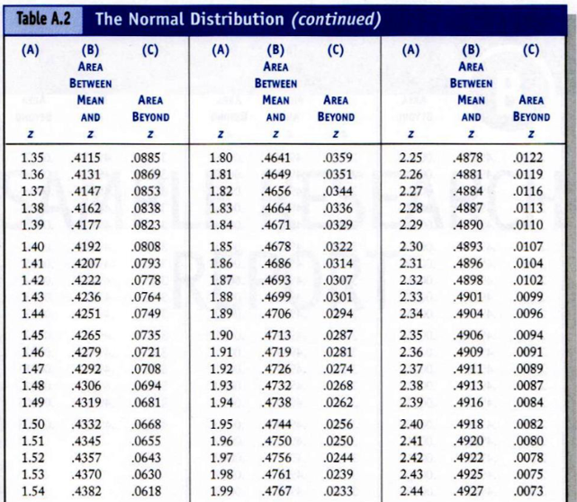

```{r setup, include=FALSE}
knitr::opts_chunk$set(echo = FALSE)
library(learnr)
library(knitr)
library(IntroStatsTutorials)
```

# Normal Distribution and Probabilities 

## Overview

This tutorial focuses on the normal distribution, z-scores, areas under the distribution curve, and probability basics. 

The PowerPoint slides for the presentation in the videos are on Canvas if you want a copy.

The videos (as well as others) can also be found on my YouTube channel https://www.youtube.com/channel/UC5kDZTyHZlgSgSEa3YQXOig 

### Learning Objectives

Learning Objectives:

Calculate normal curve areas and percentiles using R

Use normal distribution areas to estimate vales

Describe the prevalence of the normal distribution

Calculate basic probability values

Apply probability concepts to data-based problems

## Packages 

This tutorial uses the following packages:

* `learnr` and `shiny` and `rmarkdown` for aspects of the tutorial

These packages should be automatically loaded within this tutorial (but you already installed `learnr` if you are here). If you are working outside of this tutorial (e.g., working with the data files and trying analysis in R) then you need to make sure that the necessary packages are installed on your computer.

## Video 1 Introduction the Normal Distribution


## Quiz 1 

```{r quiz1}
learnr::quiz(
  learnr::question("The normal distribution follows a ______ shape",
    learnr::answer("Bell", correct = TRUE),
    learnr::answer("Rectangle"),
    learnr::answer("Skewed"),
    learnr::answer("None of the above"),
    correct = "Correct! Yes, another name for the normal distibution is the Bell Curve",
    incorrect = "Sorry, that is incorrect. Try again.",
    random_answer_order = TRUE,
    allow_retry = T
  ),
  learnr::question("When instructors actually grade on a curve",
    learnr::answer("A grades are not very common", correct = TRUE),
    learnr::answer("There are always more As than if they did not"),
    learnr::answer("Almost everyone gets an A or a B"),
    learnr::answer("None of the above"),
    correct = "Correct. By a strict definition, grading on a curve means the most common grade will be a C",
    random_answer_order = TRUE,
    incorrect = "Sorry, that is incorrect. Try again.",
    allow_retry = T
  )
)

``` 

## Video 2 z-scores and the Normal Distribution Table


## Quiz 2 


$\huge z=\frac{x-\bar{x}}{s}$

```{r quiz2, ECHO=F}
learnr::quiz(
  learnr::question("What proportion of scores would you expect to fall above z = 1.96?",
    learnr::answer(".025", correct = TRUE),
    learnr::answer(".975"),
    learnr::answer(".50"),
    learnr::answer(".35"),
    correct = "Correct! 2.5% of scores would fall at z of 1.96 or higher",
    incorrect = "Sorry, that is incorrect. Try again.",
    random_answer_order = TRUE,
    allow_retry = T
  ),
  learnr::question("An exam has a mean of 10 and a standard deviation of 4. What would be the z-score associated with a score of 19?",
    learnr::answer("2.25", correct = TRUE),
    learnr::answer("0"),
    learnr::answer("1.5"),
    learnr::answer("None of the above"),
    correct = "Correct. $\frac{19-10}{4}=2.25$",
    random_answer_order = TRUE,
    incorrect = "Sorry, that is incorrect. Try again.",
    allow_retry = T
  ),
  learnr::question("Using the information from the problem above (M = 10, s = 4) how many student in a class of 100 would you expect to score 19 or more?",
    learnr::answer("1 or 2", correct = TRUE),
    learnr::answer("99"),
    learnr::answer("0"),
    learnr::answer("None of the above"),
    correct = "Correct. If z = 2.25 that means 1.22% of the scores will fall at 19 or higher.",
    random_answer_order = TRUE,
    incorrect = "Sorry, that is incorrect. Try again.",
    allow_retry = T
  )
)

``` 

## Video 3 Getting area with R


## Exercise: Area with R

The code below uses the **pnorm** command to calculate the area associated with a specific z-score. The command below does this for a z = 1. There are three useful things we can do with this code. The command below tells us the area at or below 1.0. 

```{r}
knitr::opts_chunk$set(echo = TRUE)
```

```{r ECHO=T, EVAL=T}
pnorm(1)
```

Sometimes we want the area at or above a certain point. This version of the code yields that by simply subtracting the total area (always 1) from the area at or below 1.0. What remains is the area at or above 1.0.

```{r EVAL=T, ECHO=TRUE}
1-pnorm(1)
```

Finally, we sometimes want to get the area between a value and the mean (0). Note that this is the same as 1-pnorm(1)-.50.


```{r ECHO=T, EVAL=T}
pnorm(1)-pnorm(0)
```


In a class exam with a M = 10 and s = 4, your instructor sets the A at a score of 15. What proportion of students would get an A? Adapt the appropriate code from above to answer. 

$\huge z=\frac{x-\bar{x}}{s}$

```{r ex2, exercise = TRUE, exercise.lines = 1}

```

```{r ex2-solution}
1-pnorm(1.25)
```

## Video 4 Normal Distribution Properties


## Quiz
```{r echo=FALSE}
knitr::opts_chunk$set(echo = FALSE)
```

$\huge z=\frac{x-\bar{x}}{s}$

```{r quiz3, ECHO=F}
learnr::quiz(
  learnr::question("What proportion of scores would you expect to fall at or above the mean?",
    learnr::answer(".50", correct = TRUE),
    learnr::answer(".05"),
    learnr::answer(".70"),
    learnr::answer("It depends on the standard deviation"),
    correct = "Correct! 50% of scores would fall at or above the mean (0). In a normal distribution, the mean always corresponds to z = 0.",
    incorrect = "Sorry, that is incorrect. Try again.",
    random_answer_order = TRUE,
    allow_retry = T
  ),
  learnr::question("What areas are more extreme than z = 1.96?" ,
    learnr::answer("Scores at or above z = 1.96 and scores at or below z = -1.96", correct = TRUE),
    learnr::answer("Scores at or above z = 1.96"),
    learnr::answer("Scores at or below z = 1.96"),
    learnr::answer("Scores at or below z = -1.96"),
    correct = "Correct. More extreme than always refers to scores on either size of the distribution.",
    random_answer_order = TRUE,
    incorrect = "Sorry, that is incorrect. Try again.",
    allow_retry = T
  )
)

``` 

## Video 5 Sample Problems


## z score practice

Imagine you took an intelligence test online. The test reports the following information: scores range from 0 to 240; the mean score is 100 with a standard deviation of 15; scores are normally distributed. The test authors report the following categories for scores

130 and higher = Extremely smart  
115-130 = Smart  
85-115 	= Average  
70-85  	= Not so smart  
70 and below = Extremely not smart  

Use the space below to perform calculations (using **pnorm**) to answer the quiz questions. 

$\huge z=\frac{x-\bar{x}}{s}$

```{r ex3, exercise = TRUE, exercise.lines = 1}

```

```{r quiz4, ECHO=F}
learnr::quiz(
  learnr::question("What proportion of test takers are either 'Not so smart' or 'extremely not smart'",
    learnr::answer(".1587", correct = TRUE),
    learnr::answer(".8413"),
    learnr::answer(".50"),
    learnr::answer("None"),
    correct = "Correct! This would correspond to all of the scores at 85 and below. 85 corresponds to a z of -1. pnorm(-1) gives the area at or below 85.",
    incorrect = "Sorry, that is incorrect. Try again.",
    random_answer_order = TRUE,
    allow_retry = T
  ),
  learnr::question("What proportion are Average?" ,
    learnr::answer(".6827", correct = TRUE),
    learnr::answer(".8413"),
    learnr::answer(".1587"),
    learnr::answer("None"),
    correct = "Correct. This would reflect scores of 85-115 (zs = 1, -1). pnorm(1)-pnorm(-1)",
    random_answer_order = TRUE,
    incorrect = "Sorry, that is incorrect. Try again.",
    allow_retry = T
  ),
  learnr::question("What proportion are Extremely Smart??" ,
    learnr::answer(".0228", correct = TRUE),
    learnr::answer(".9772"),
    learnr::answer(".50"),
    learnr::answer("None"),
    correct = "Correct. This would reflect scores of 130 or higher. 1-pnorm(2)",
    random_answer_order = TRUE,
    incorrect = "Sorry, that is incorrect. Try again.",
    allow_retry = T
  )
)

``` 
## Video 6 Percentiles


## Quiz Percentiles
Imagine you took an intelligence test online. The test reports the following information: scores range from 0 to 240; the mean score is 100 with a standard deviation of 15; scores are normally distributed. The test authors report the following categories for scores

Use the space below to perform calculations (using **pnorm**) to answer the quiz questions. 

$\huge z=\frac{x-\bar{x}}{s}$

```{r ex5, exercise = TRUE, exercise.lines = 1}

```

```{r quiz5, ECHO=F}
learnr::quiz(
  learnr::question("What percentile is a score of 120",
    learnr::answer("91st", correct = TRUE),
    learnr::answer("9th"),
    learnr::answer("50th"),
    learnr::answer("100th"),
    correct = "Correct! This would correspond to all of the scores at 120 and below. 85 corresponds to a z of -1.33",
    incorrect = "Sorry, that is incorrect. Try again.",
    random_answer_order = TRUE,
    allow_retry = T
  ),
  learnr::question("What percentile corresponds to the median" ,
    learnr::answer("50th", correct = TRUE),
    learnr::answer("75th"),
    learnr::answer("25th"),
    learnr::answer("I would have to know the exact median"),
    correct = "Correct. The median is another name for 50th %ile",
    random_answer_order = TRUE,
    incorrect = "Sorry, that is incorrect. Try again.",
    allow_retry = T
 )
)

``` 


## Video 7 Probability 


## Quiz 


```{r quiz6, ECHO=F}
learnr::quiz(
  learnr::question("Which of the following values is a probability",
    learnr::answer(".05", correct = TRUE),
    learnr::answer("5%"),
    learnr::answer("1 out of 5"),
    learnr::answer("1.05"),
    correct = "Correct! Probability values range from 0 to 1",
    incorrect = "Sorry, that is incorrect. Try again.",
    random_answer_order = TRUE,
    allow_retry = T
  ),
  learnr::question("If something happens one of of 10 times, the probability for this event is ..." ,
    learnr::answer(".10", correct = TRUE),
    learnr::answer("10"),
    learnr::answer(".5"),
    learnr::answer("Not enough information to answer the question"),
    correct = "Correct. 1/10=.10",
    random_answer_order = TRUE,
    incorrect = "Sorry, that is incorrect. Try again.",
    allow_retry = T
 )
)

``` 

## Video Probability Basics


## Quiz

```{r quiz7, ECHO=F}
learnr::quiz(
  learnr::question("If p(a) = p(a|b), events are ... ",
    learnr::answer("Independent", correct = TRUE),
    learnr::answer("Mutually exclusive"),
    learnr::answer("Exhaustive"),
    learnr::answer("Conditional"),
    correct = "Correct!",
    incorrect = "Sorry, that is incorrect. Try again.",
    random_answer_order = TRUE,
    allow_retry = T
  ),
  learnr::question("p(a|b) is read as ..." ,
    learnr::answer("probability of a given b", correct = TRUE),
    learnr::answer("probability of b given a"),
    learnr::answer("the independence rule"),
    learnr::answer("the mutually exclusive rule"),
    correct = "Correct. This is also called a conditional probability",
    random_answer_order = TRUE,
    incorrect = "Sorry, that is incorrect. Try again.",
    allow_retry = T
 )
)

``` 

## Video Probability Calculations


## Quiz
$p(a)=\frac{events favoring a}{total events}$  

$p(a|b)=$ The probability of a for only those people who are in the b category  

If $p(a)=p(a|b)$ events are independent  

```{r}
Outcome<-c("Death Penalty","Life Sentence","Total")
AA<-c(95,425,520)
Other<-c(19,128,147)
Total<-c(114,553,667)
xx<-cbind(Outcome,AA,Other,Total)
knitr::kable(xx)
```

```{r quiz8, ECHO=F}
learnr::quiz(
  learnr::question("What is the probability of a death sentence?",
    learnr::answer(".17", correct = TRUE),
    learnr::answer(".78"),
    learnr::answer(".22"),
    learnr::answer(".83"),
    correct = "Correct! Take the total number of death penalty cases (114) and divide by the total number of cases",
    incorrect = "Sorry, that is incorrect. Try again.",
    random_answer_order = TRUE,
    allow_retry = T
  ),
  learnr::question("Given that a defendent is in the all other category, what is the probability of a death sentence?" ,
    learnr::answer(".13", correct = TRUE),
    learnr::answer(".78"),
    learnr::answer(".03"),
    learnr::answer(".17"),
    correct = "Correct. p(a|b) = p(Death|All other). Take the all other - death penalty verdicts (19) and divide by the total all other cases (147)",
    random_answer_order = TRUE,
    incorrect = "Sorry, that is incorrect. Try again.",
    allow_retry = T
 ),
   learnr::question("Is type of sentence independent of race?" ,
    learnr::answer("No", correct = TRUE),
    learnr::answer("Yes"),
    learnr::answer("Not enough information"),
    correct = "Correct. p(a) does not equal p(a|b). Those in the all other category were less likely to receive a death sentence",
    random_answer_order = TRUE,
    incorrect = "Sorry, that is incorrect. Try again.",
    allow_retry = T
 )
)

``` 


## 

Congratulations! You've reached the end of the tutorial. Here is what you need to do to obtain credit. Take the completion token below and copy it. Open Canvas as go to the assignment called Normal Distribution and Probability tutorial. Enter your token!


```{r echo=F}
stringi::stri_rand_strings(1, 5, pattern = "[A-Za-z0-9]")
```

